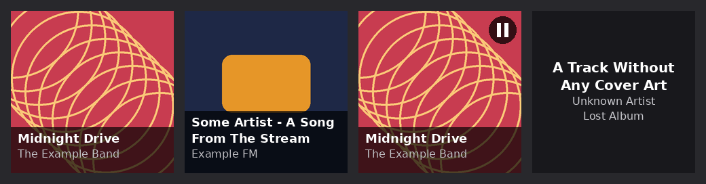

# moode-smalltv

Show what [moOde Audio](https://moodeaudio.org/) is playing on a **GeekMagic SmallTV-Ultra**, the small 240x240 Wi-Fi display. Cover art, title and artist, updated a few seconds after each track change.

It is a small Python service that runs on the moOde Raspberry Pi. No firmware flashing, no Home Assistant, no extra server.



## Features

- Cover art with title and artist for the music library and Spotify Connect.
- Web radio shows the station logo, the stream title and the station name.
- Other renderers (AirPlay, Bluetooth...) show at least their name. Only Spotify Connect has been tested.
- A pause icon when paused, then the screen's clock after 1 minute (configurable).
- The clock after 5 minutes stopped (configurable).
- Text-only screen when there is no cover art.
- Dimmed brightness at night.
- Uploads only when the picture changes. The screen storage never fills up.
- Survives a screen or network outage and picks up again on its own.
- Light. About 45 MB of RAM, runs at low priority so it never competes with audio playback.

## Requirements

| | Tested with |
|---|---|
| moOde Audio | 10.2.0 (Debian 13 Trixie, Python 3.13) on a Raspberry Pi 4B |
| Screen | GeekMagic SmallTV-Ultra, stock firmware `Ultra-V9.0.54` |

moOde 9 (Debian 12 Bookworm, Python 3.11) should work, the CI tests that Python version, but it has not been tried on a real device yet. Reports are welcome.

The screen only talks Wi-Fi 2.4 GHz and must be on the same network as the Pi. It can be powered from one of the Pi's USB ports.

## Install

**1. Enable the metadata file in moOde.** Go to Configure > Audio > MPD Options and turn on **Metadata file**.

**2. Find the screen's IP address.** The SmallTV shows it at boot. Giving it a fixed address in your router's DHCP settings is a good idea.

**3. Install on the Pi**, over SSH.

```sh
git clone https://github.com/jerem-lpg/moode-smalltv.git
cd moode-smalltv
sudo sh install.sh 192.168.1.100   # the screen's IP
```

Or, from your computer, with SSH access to the Pi:

```sh
./deploy.sh pi@moode.local 192.168.1.100
```

The installer adds the missing apt packages (`python3-pil`, `python3-requests`, `fonts-dejavu-core`), copies the app to `/opt/moode-smalltv` and starts the `moode-smalltv` systemd service. Running it again updates the app and keeps your configuration.

## Configuration

Edit `/opt/moode-smalltv/config.toml` on the Pi, then run `sudo systemctl restart moode-smalltv`.

| Key | Default | Meaning |
|---|---|---|
| `screen_host` | | IP address of the screen |
| `stop_minutes` | `5` | Minutes stopped before showing the clock |
| `pause_minutes` | `1` | Minutes paused before showing the clock |
| `brightness_day` | `80` | Brightness 0-100 |
| `brightness_night` | `20` | Brightness between `night_start` and `night_end` |
| `night_start` / `night_end` | `22:00` / `07:00` | Night period, Pi local time. Set both values to the same time to keep a fixed brightness |

See [config.example.toml](config.example.toml) for the advanced keys.

## Troubleshooting

Everything goes to the journal.

```sh
journalctl -u moode-smalltv -f
```

A healthy log looks like this.

```
INFO moode-smalltv 1.0.0, screen 192.168.1.100, file /var/local/www/currentsong.txt
INFO Brightness 80
INFO Showing Midnight Drive / The Example Band [play] 18 KB in 1.9 s (cover 0.1 s)
```

| Symptom | What to check |
|---|---|
| `GET /app.json ... retrying in N s` | The screen is off, on another network, or its IP changed. Open `http://<screen-ip>/` in a browser |
| Nothing happens on track change | `ls -l /var/local/www/currentsong.txt` must exist and change. If not, enable the metadata file (step 1) |
| `missing on the screen after upload` | Screen storage is full. Check `http://<screen-ip>/space.json` and delete old pictures from the screen's web page |
| `No cover from ...` | The cover could not be downloaded. The text-only screen is shown instead |
| Screen shows its own theme | Another app or the screen's web page changed the theme. The service puts it back within 10 s |

## Uninstall

From the cloned folder on the Pi:

```sh
sudo sh uninstall.sh
```

## How it works

Every second the service checks the modification time of moOde's `/var/local/www/currentsong.txt`. When the content that matters changes (title, artist, album, state, cover), it draws a 240x240 JPEG with Pillow and uploads it to the screen over plain HTTP. Two file names are used in turn so the old picture is deleted only after the new one is displayed.

The details, the screen's HTTP API and the moOde behaviours this relies on are in [docs/internals.md](docs/internals.md).

## Development

```sh
python3 -m venv .venv
.venv/bin/pip install -r requirements.txt ruff
.venv/bin/python -m unittest -v
.venv/bin/ruff check . && .venv/bin/ruff format --check .
```

To try it from your computer against the real screen, copy `config.example.toml` to `config.toml` (it is git-ignored), set `screen_host`, point `moode_url` to `http://<pi-ip>`, `currentsong` to a local copy of the file, and the two font paths to fonts on your machine. Then run `python -m moode_smalltv.main -c config.toml`. Stop the service on the Pi first, the screen can only serve one client at a time.

The tests use real `currentsong.txt` files in [tests/fixtures](tests/fixtures). If a moOde update breaks something, a new fixture showing the new format is the most useful bug report.

## Credits

- The SmallTV-Ultra HTTP API comes from the reverse-engineering work documented in [geekmagic-stats](https://docs.rs/crate/geekmagic-stats/latest/source/device-protocol.md).
- This project is not affiliated with moOde Audio or GeekMagic.

## License

[MIT](LICENSE)
